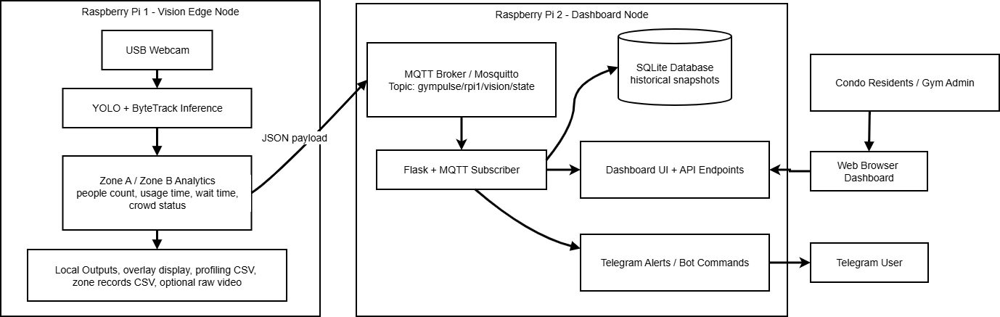

# GymPulse — Real-Time Gym Equipment Monitoring System

**INF2009: Edge Computing and Analytics — Group 25**
Singapore Institute of Technology

## Overview

GymPulse is a real-time gym equipment monitoring system designed for condominium gyms, built on a 2-Raspberry Pi edge computing architecture. It uses computer vision to detect people, track their movement across equipment zones, and determine whether gym machines are actively in use, all of which processed at the edge with no cloud dependency.

A live web dashboard displays zone occupancy, session timers, and usage history. Telegram alerts notify condo gym users only when overall gym crowd status is HIGH (with a configurable cooldown). If status is not HIGH, no automatic alert is sent.

## System Architecture



The two Raspberry Pis communicate over a local network. RPi 1 runs the vision pipeline with a USB camera and publishes JSON state to the MQTT broker on RPi 2 at 1 Hz. On RPi 2, the Flask + MQTT subscriber updates SQLite snapshots, serves the web dashboard to residents/admin users, and powers Telegram alerts/commands.

## Key Features

- **Person detection and tracking** — YOLO26n (exported to NCNN for ARM optimisation) detects people in the camera feed. ByteTrack maintains persistent track IDs across frames.
- **Equipment zone ownership** — Two configurable equipment zones with polygon boundaries. The system assigns a zone owner based on proximity to the equipment centre, with a still-duration gate to prevent walk-through false positives.
- **Session continuity (ghost recovery)** — When the tracker briefly loses an ID during occlusion, the system preserves the session state and restores it when the same person reappears nearby, preventing session timer resets.
- **Validity checking** — Determines whether the zone owner is likely using the equipment based on proximity between the person’s bounding box centre and the equipment centre, rather than relying on pose or exercise recognition.
- **Live web dashboard** — Real-time zone status, session timers, occupancy counts, unique visitor counts, and historical usage charts served via Flask.
- **Telegram alerts** — Automatic alert is triggered only when crowd status is HIGH (with cooldown). If crowd status is not HIGH, no auto-alert is sent. The bot still supports on-demand status checks via command.
- **Performance profiling** — Built-in 1 Hz CSV logging of FPS, per-stage latency (capture, inference, postprocess, display), CPU usage, memory, and context switches for edge performance analysis.

### Telegram Notification Example

```text
🚨 GymPulse Alert
Crowd status: HIGH
Total people: 6
Zone A est. wait: 1.0s
Zone B est. wait: 0.0s
Timestamp: 2026-03-29 17:36:36
```

## Repository Contents

| File | Description |
|------|-------------|
| `source_codes/gym_roi_people_time_v3.py` | RPi 1 vision pipeline — YOLO detection, ByteTrack tracking, zone ownership, MQTT publishing |
| `source_codes/app.py` | RPi 2 dashboard — Flask web server, MQTT subscriber, SQLite storage, Telegram bot |
| `source_codes/gym_equipment_zone_records.csv` | Sample per-zone time-series logs from a test run (occupancy, ownership, and session duration at 1 Hz) |
| `source_codes/gym_profile_1hz.csv` | Sample 1 Hz performance profiling data (FPS, latency, CPU, memory) |

## Quick Start

### RPi 1 — Vision Pipeline

```bash
# Dependencies
pip install ultralytics opencv-python-headless paho-mqtt psutil numpy

- Use `opencv-python` for local development with display (`cv2.imshow`)
- Use `opencv-python-headless` for headless deployment on Raspberry Pi

# Run (adjust model path and broker IP as needed)
python source_codes/gym_roi_people_time_v3.py
```

Key configuration (edit at the top of the script):

```python
MODEL_PATH = "/home/keithpi5/Desktop/Project/yolo26n_ncnn_model"
MQTT_BROKER = "172.20.10.3"   # IP of RPi 2
CAMERA_INDEX = 0
```

### RPi 2 — Dashboard + MQTT Broker

```bash
# Install Mosquitto broker
sudo apt install mosquitto mosquitto-clients

# Dependencies
pip install flask paho-mqtt

# Optional: create telegram.env for alerts
echo 'TELEGRAM_ENABLED=true' > telegram.env
echo 'TELEGRAM_BOT_TOKEN=your_token' >> telegram.env
echo 'TELEGRAM_CHAT_ID=your_chat_id' >> telegram.env

# Run
python source_codes/app.py
```

The dashboard is accessible at `http://<RPi2-IP>:5000`.

## Equipment Zone Configuration

Zones are defined as polygons in pixel coordinates (base resolution 640x480). Edit `BASE_EQUIPMENT_ZONES` in `source_codes/gym_roi_people_time_v3.py` to match your gym layout:

```python
BASE_EQUIPMENT_ZONES = {
    "equipment_a": {
        "polygon": np.array([(20, 60), (360, 60), (360, 430), (20, 430)]),
        "equipment_center": (200, 245),
    },
    "equipment_b": {
        "polygon": np.array([(380, 60), (620, 60), (620, 430), (380, 430)]),
        "equipment_center": (480, 245),
    },
}
```

## MQTT Topic

All vision state is published to `gympulse/rpi1/vision/state` as a JSON payload containing per-zone occupancy, session timers, owner IDs, validity flags, and performance metrics.

## Tech Stack

- **Detection**: YOLO26n (Ultralytics), exported to NCNN for Raspberry Pi ARM inference
- **Tracking**: ByteTrack (via Ultralytics)
- **Communication**: MQTT (Mosquitto broker, paho-mqtt client)
- **Dashboard**: Flask, SQLite, HTML/JS
- **Alerts**: Telegram Bot API
- **Hardware**: Raspberry Pi 4/5, USB webcam

## Module — INF2009: Edge Computing and Analytics

Singapore Institute of Technology, Trimester 2, 2025/2026
